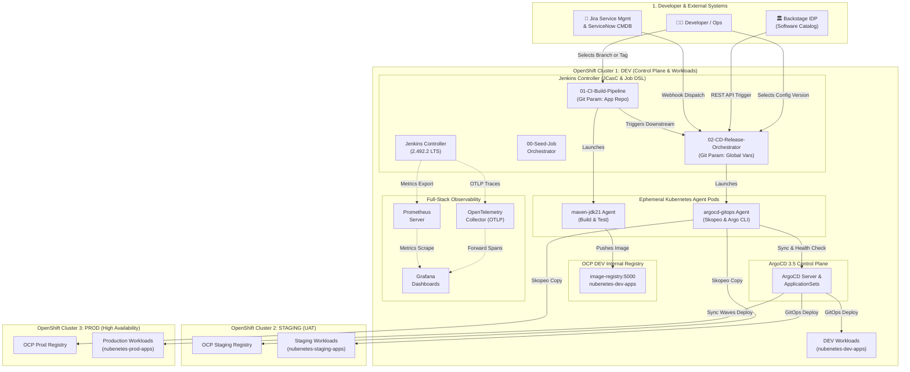
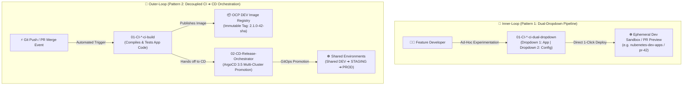
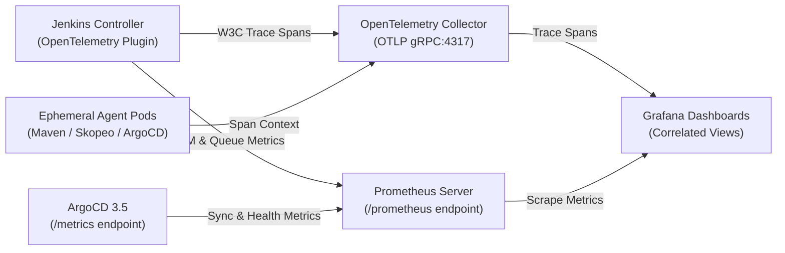
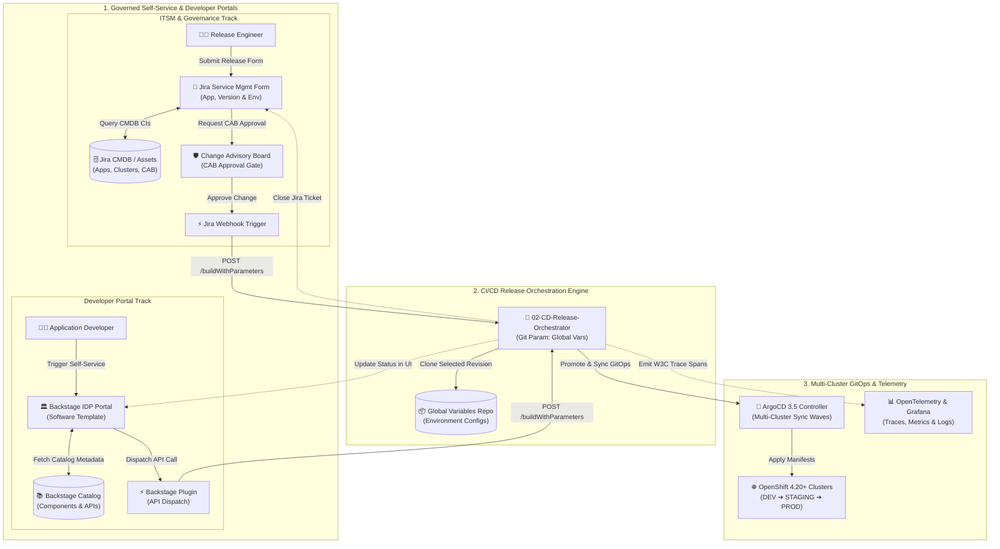
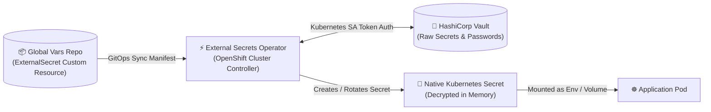
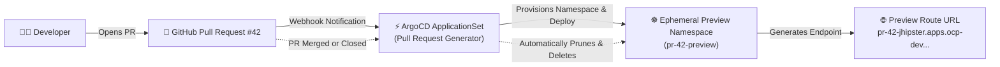
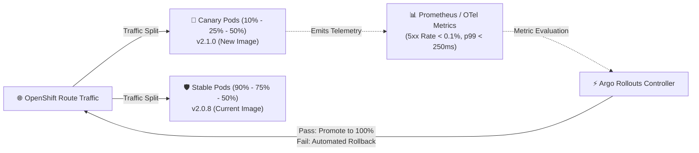

# Jenkins Git Parameter & Multi-Cluster GitOps IaC Platform on OpenShift 4.20+

> [!WARNING]
> **AI Generation & Template Disclaimer**
> This repository has been generated by **Gemini 3.7 Flash** and has not been tested nor validated in a real production environment. Its purpose is strictly for the generation of reference architectures, templates, design patterns, and Infrastructure as Code (IaC) blueprints.

<div align="center">

[](https://docs.redhat.com/en/documentation/openshift_container_platform/4.17/)
[](https://kubernetes.io/)
[](https://www.jenkins.io/)
[](https://argo-cd.readthedocs.io/en/stable/)
[](https://helm.sh/)

[](https://www.jenkins.io/projects/jcasc/)
[](https://jenkinsci.github.io/job-dsl-plugin/)
[](https://plugins.jenkins.io/git-parameter/)
[](https://opentelemetry.io/)
[](https://prometheus.io/)
[](https://grafana.com/)
[](https://openjdk.org/projects/jdk/21/)
[](https://spring.io/projects/spring-boot)
[](https://angular.dev/)
[](https://github.com/containers/skopeo)
[](https://trivy.dev/)
[](https://docs.redhat.com/en/documentation/openshift_container_platform/4.17/html/authentication_and_authorization/managing-pod-security-policies)
[](LICENSE)
[](https://github.com/nubenetes/jenkins-git-parameter/pulls)
[](https://github.com/nubenetes/jenkins-git-parameter)

</div>

---

## 📑 Table of Contents

- [Executive Summary & Architecture Overview](#executive-summary--architecture-overview)
- [In-Depth Architectural Analysis & Design Decisions](#in-depth-architectural-analysis--design-decisions)
  - [1. Multi-Repository Git Parameter Investigation: Two Architectural Patterns](#1-multi-repository-git-parameter-investigation-two-architectural-patterns)
    - [The Core Problem: Why Did Pipeline 01 Initially Have a Text Box?](#the-core-problem-why-did-pipeline-01-initially-have-a-text-box)
    - [Pattern 1: Dual Git Parameter Dropdowns in a Single Pipeline (Multi-Remote SCM)](#pattern-1-dual-git-parameter-dropdowns-in-a-single-pipeline-multi-remote-scm)
    - [Pattern 2: Decoupled Two-Pipeline Architecture (CI -> CD Hand-off)](#pattern-2-decoupled-two-pipeline-architecture-ci--cd-hand-off-recommended)
    - [When to Use Each Pattern: Environment & Persona Decision Matrix](#when-to-use-each-pattern-environment--persona-decision-matrix)
    - [Coexistence Strategy: Combining Pattern 1 (Inner-Loop) & Pattern 2 (Outer-Loop) in Development](#coexistence-strategy-combining-pattern-1-inner-loop--pattern-2-outer-loop-in-development)
  - [2. Job DSL + Declarative Pipelines vs. Monolithic Shared Libraries](#2-job-dsl--declarative-pipelines-vs-monolithic-shared-libraries)
  - [3. OpenShift 4.20+ Security & Ephemeral Kubernetes Agents](#3-openshift-420-security--ephemeral-kubernetes-agents)
  - [4. ArgoCD 3.5 Integration & Multi-Cluster Promotion](#4-argocd-35-integration--multi-cluster-promotion)
  - [5. Full-Stack Observability: OpenTelemetry, Prometheus & Grafana](#5-full-stack-observability-opentelemetry-prometheus--grafana)
- [Repository Structure](#repository-structure)
- [Quick Start: 1-Click Automated Deployment](#quick-start-1-click-automated-deployment)
  - [Prerequisites](#prerequisites)
  - [1. Deploy the Complete Platform](#1-deploy-the-complete-platform)
  - [2. Verify Platform Endpoints](#2-verify-platform-endpoints)
  - [3. Triggering Pipelines & `GLOBAL_VARS_REVISION` Selection](#3-triggering-pipelines--global_vars_revision-selection)
    - [Scenario A: Triggering from Pipeline 01 (CI)](#scenario-a-triggering-from-pipeline-01-01-ci-build-pipelines)
    - [Scenario B: Triggering Directly from Pipeline 02 (CD)](#scenario-b-triggering-directly-from-pipeline-02-02-cd-release-orchestrators)
    - [Scenario C: Triggering via Jira Forms, CMDB (Assets) & ITSM / Backstage IDP](#scenario-c-triggering-via-jira-forms-cmdb-assets--itsm--backstage-idp)
      - [Why Jira Forms + CMDB is the Industry Standard for Cloud-Native Releases](#why-jira-forms--cmdb-is-the-industry-standard-for-cloud-native-releases)
    - [Parameter Selection Matrix](#parameter-selection-matrix)
- [Enterprise Production Hardening & Advanced Best Practices](#️-enterprise-production-hardening--advanced-best-practices)
  - [1. Supply Chain Security: Cosign Image Signing & SBOM Attestation (SLSA 3)](#1-supply-chain-security-cosign-image-signing--sbom-attestation-slsa-3)
  - [2. Zero-Trust Secret Management: External Secrets Operator (ESO) + HashiCorp Vault](#2-zero-trust-secret-management-external-secrets-operator-eso--hashicorp-vault)
  - [3. Dynamic Ephemeral PR Preview Environments with ArgoCD ApplicationSet](#3-dynamic-ephemeral-pr-preview-environments-with-argocd-applicationset)
  - [4. Progressive Delivery with Argo Rollouts (Metric-Driven Canary)](#4-progressive-delivery-with-argo-rollouts-metric-driven-canary)
  - [5. Automated Credential Rotation: GitHub App Authentication via JCasC](#5-automated-credential-rotation-github-app-authentication-via-jcasc)
  - [Strategic Roadmap: Impact vs. Implementation Effort](#strategic-roadmap-impact-vs-implementation-effort)
- [Decommissioning & Reinstallation](#decommissioning--reinstallation)
  - [Clean Decommission](#clean-decommission)
  - [Full Reinstallation](#full-reinstallation)
- [References & Evidence Links](#references--evidence-links)

---

## Executive Summary & Architecture Overview

This repository provides an enterprise-grade, end-to-end **Infrastructure as Code (IaC)** blueprint and GitOps orchestration engine hosted on **Red Hat OpenShift Container Platform (OCP) 4.20+**. 

The solution addresses a core enterprise challenge: **how to build, govern, promote, and release multi-repository cloud-native microservices across 3 distinct OpenShift clusters (DEV, STAGING, PROD) while leveraging dynamic Git Parameter selection, Declarative Pipelines as Code, ArgoCD 3.5 GitOps synchronization, and unified OpenTelemetry observability.**



---

## In-Depth Architectural Analysis & Design Decisions

### 1. Multi-Repository Git Parameter Investigation: Two Architectural Patterns

#### The Core Problem: Why Did Pipeline 01 Initially Have a Text Box?
In cloud-native architectures, applications separate source code (`app-repo`) from centralized environmental configuration, cluster definitions, and Helm values (`jenkins-git-parameter-global-vars`).

When utilizing the Jenkins `git-parameter` plugin across multiple repositories, two fundamental constraints emerge:
1. **Pre-Execution Evaluation Lifecycle**: Jenkins evaluates and renders job parameters in the browser **before** allocating an agent and before executing any `Jenkinsfile` stages.
2. **SCM Binding Constraint**: The `git-parameter` plugin queries remote Git references by inspecting the SCM configured on the Jenkins Master Job XML. In standard Pipeline jobs (`cpsScm`), Jenkins allows only **one** top-level SCM block. If a pipeline clones a secondary repository dynamically inside a stage (`steps { checkout(...) }`), the Jenkins Master cannot discover or populate a dropdown for that secondary repository prior to execution.

To solve this challenge, this repository **implements and delivers BOTH architectural patterns as working code**:

---

#### Pattern 1: Dual Git Parameter Dropdowns in a Single Pipeline (Multi-Remote SCM)
*Implemented in: [`jobdsl/pipelines-ci.groovy`](jobdsl/pipelines-ci.groovy) (`*-ci-dual-dropdown`) and [`jenkinsfiles/ci/Jenkinsfile.app-java-maven-dual-dropdown`](jenkinsfiles/ci/Jenkinsfile.app-java-maven-dual-dropdown)*

Job DSL configures a single `git` SCM definition containing **multiple named Git `remote` blocks** with dedicated refspecs. The Git Parameter plugin can then target each remote independently using `useRepository`:

```groovy
// Job DSL Implementation: Multi-Remote SCM with 2 Dynamic Dropdowns
pipelineJob("01-CI-Build-Pipelines/jhipster-microservice-ci-dual-dropdown") {
    parameters {
        // Dropdown 1: Application Repository (Branches & Tags)
        gitParameterDefinition {
            name('APP_GIT_REVISION')
            type('PT_BRANCH_TAG')
            defaultValue('main')
            useRepository('origin-app') // Targets Remote 1
            sortMode('DESCENDING_SMART')
        }

        // Dropdown 2: Global Variables Repository (Branches & Tags)
        gitParameterDefinition {
            name('GLOBAL_VARS_REVISION')
            type('PT_BRANCH_TAG')
            defaultValue('main')
            useRepository('origin-vars') // Targets Remote 2
            sortMode('DESCENDING_SMART')
        }
    }

    definition {
        cpsScm {
            scm {
                git {
                    remote {
                        name('origin-app')
                        url('https://github.com/nubenetes/jhipster-microservice.git')
                        refspec('+refs/heads/*:refs/remotes/origin-app/* +refs/tags/*:refs/remotes/origin-app/tags/*')
                    }
                    remote {
                        name('origin-vars')
                        url('https://github.com/nubenetes/jenkins-git-parameter-global-vars.git')
                        refspec('+refs/heads/*:refs/remotes/origin-vars/* +refs/tags/*:refs/remotes/origin-vars/tags/*')
                    }
                    branch('origin-app/main')
                }
            }
            scriptPath('jenkinsfiles/ci/Jenkinsfile.app-java-maven-dual-dropdown')
        }
    }
}
```

---

#### Pattern 2: Decoupled Two-Pipeline Architecture (CI $\rightarrow$ CD Hand-off) [RECOMMENDED]
*Implemented in: [`jobdsl/pipelines-ci.groovy`](jobdsl/pipelines-ci.groovy) (`*-ci-build`), [`jenkinsfiles/ci/Jenkinsfile.app-java-maven`](jenkinsfiles/ci/Jenkinsfile.app-java-maven), [`jobdsl/pipelines-cd.groovy`](jobdsl/pipelines-cd.groovy) (`multi-cluster-release-orchestrator`), and [`jenkinsfiles/cd/Jenkinsfile.release-orchestrator`](jenkinsfiles/cd/Jenkinsfile.release-orchestrator)*

Separates artifact creation from release promotion. Pipeline 01 focuses on building the application code with its own Git Parameter dropdown, while Pipeline 02 is bound to `jenkins-git-parameter-global-vars` with its own Git Parameter dropdown for multi-cluster release orchestration.

##### 1. Pipeline 01: CI Build Pipeline (App Code & Downstream Hand-off)

**A. Job DSL Implementation (`jobdsl/pipelines-ci.groovy`):**
Configures a dedicated `gitParameterDefinition` targeting the application repository, alongside parameters to configure the downstream release trigger:

```groovy
// Job DSL Implementation: Decoupled CI Build Pipeline with Application Git Parameter
pipelineJob("01-CI-Build-Pipelines/jhipster-microservice-ci-build") {
    description('''
    <b>[PATTERN 2: Decoupled CI Build Pipeline - Recommended]</b><br/>
    Cloud-Native Java 21 / Spring Boot Microservice<br/>
    • <b>App Revision</b>: Dynamic Git Parameter Dropdown on https://github.com/nubenetes/jhipster-microservice.git<br/>
    • <b>Global Vars</b>: Passed via parameter to downstream 02-CD-Release-Orchestrator.
    '''.stripIndent())

    parameters {
        // Dropdown: Application Repository (Branches & Tags)
        gitParameterDefinition {
            name('APP_GIT_REVISION')
            type('PT_BRANCH_TAG')
            defaultValue('main')
            description('Select Application Git Branch/Tag from https://github.com/nubenetes/jhipster-microservice.git')
            branchFilter('.*')
            tagFilter('*')
            sortMode('DESCENDING_SMART')
            selectedValue('DEFAULT')
            useRepository('https://github.com/nubenetes/jhipster-microservice.git')
            quickFilterEnabled(true)
        }

        booleanParam('TRIGGER_CD_RELEASE', true, 'Automatically trigger downstream CD Release Orchestrator.')
        stringParam('GLOBAL_VARS_BRANCH', 'main', 'Global Variables branch to pass to downstream CD Release Orchestrator.')
        choiceParam('TARGET_ENVIRONMENT', ['dev', 'staging', 'prod'], 'Initial deployment target environment for downstream CD release.')
    }

    definition {
        cpsScm {
            scm {
                git {
                    remote {
                        url('https://github.com/nubenetes/jenkins-git-parameter.git')
                    }
                    branch('*/main')
                }
            }
            scriptPath('jenkinsfiles/ci/Jenkinsfile.app-java-maven')
            lightweight(true)
        }
    }
}
```

**B. Declarative Jenkinsfile CI Stage (`jenkinsfiles/ci/Jenkinsfile.app-java-maven`):**
Builds the container image, tags it with an immutable build identifier, and triggers Pipeline 02 passing the configuration branch and artifact metadata:

```groovy
// Jenkinsfile Stage: Compile, Package Image, and Trigger Downstream CD Orchestrator
stage('Checkout Application Code') {
    steps {
        script {
            checkout([
                $class: 'GitSCM',
                branches: [[name: "${params.APP_GIT_REVISION}"]],
                userRemoteConfigs: [[url: env.APP_REPO_URL]]
            ])
            env.GIT_COMMIT_SHORT = sh(script: 'git rev-parse --short HEAD', returnStdout: true).trim()
            env.CALCULATED_TAG   = "2.1.0-${BUILD_NUMBER}-${env.GIT_COMMIT_SHORT}"
        }
    }
}

// ... Compile, Test, Package, and Push Image stages ...

stage('Trigger CD Release Orchestrator') {
    when {
        expression { return params.TRIGGER_CD_RELEASE == true }
    }
    steps {
        echo "===> Triggering Downstream CD Release Orchestration Pipeline..."
        build job: '02-CD-Release-Orchestrators/multi-cluster-release-orchestrator',
            parameters: [
                string(name: 'GLOBAL_VARS_REVISION', value: params.GLOBAL_VARS_BRANCH ?: 'main'),
                string(name: 'APP_NAME', value: env.APP_NAME),
                string(name: 'IMAGE_TAG', value: env.CALCULATED_TAG),
                string(name: 'TARGET_ENVIRONMENT', value: params.TARGET_ENVIRONMENT ?: 'dev'),
                booleanParam(name: 'AUTO_PROMOTE_TO_STAGING', value: true),
                booleanParam(name: 'REQUIRE_PROD_APPROVAL', value: true),
                string(name: 'TRIGGERED_BY', value: 'CI_PIPELINE'),
                string(name: 'CHANGE_REQUEST_ID', value: "CI-AUTO-${BUILD_NUMBER}")
            ],
            wait: false
    }
}
```

---

##### 2. Pipeline 02: CD Release Orchestrator (Global Config Dropdown & GitOps Promotion)

**A. Job DSL Implementation (`jobdsl/pipelines-cd.groovy`):**
Configures a dedicated `gitParameterDefinition` targeting the centralized `jenkins-git-parameter-global-vars` configuration repository, exposing promotion flags and token-based REST dispatching:

```groovy
// Job DSL Implementation: Multi-Cluster CD Release Orchestrator with Global Vars Dropdown
pipelineJob("02-CD-Release-Orchestrators/multi-cluster-release-orchestrator") {
    description('''
    🚀 <b>Enterprise Multi-Cluster Release & Promotion Orchestrator</b><br/>
    Orchestrates promotion across 3 OpenShift clusters (DEV -> STAGING -> PROD) with ArgoCD 3.5.<br/>
    • Parameterized with <b>Git Parameter</b> on the Global Variables repository.<br/>
    • Can be triggered manually, by upstream CI build pipelines, or externally via REST API.
    '''.stripIndent())

    authenticationToken('RELEASE_DISPATCH_TOKEN_2026')

    parameters {
        // Dropdown: Global Variables & Multi-Cluster Environment Configuration Repo
        gitParameterDefinition {
            name('GLOBAL_VARS_REVISION')
            type('PT_BRANCH_TAG')
            defaultValue('main')
            description('Select the Git Branch or Tag from Global Configuration (jenkins-git-parameter-global-vars)')
            branchFilter('.*')
            tagFilter('*')
            sortMode('DESCENDING_SMART')
            selectedValue('DEFAULT')
            useRepository('https://github.com/nubenetes/jenkins-git-parameter-global-vars.git')
            quickFilterEnabled(true)
        }

        choiceParam('APP_NAME', ['jhipster-microservice', 'angular-frontend', 'all-apps'], 'Application to release and promote.')
        stringParam('IMAGE_TAG', 'latest', 'Container Image Tag to deploy and promote across OpenShift clusters.')
        choiceParam('TARGET_ENVIRONMENT', ['dev', 'staging', 'prod', 'full-promotion-chain'], 'Target environment or full promotional chain.')
        booleanParam('AUTO_PROMOTE_TO_STAGING', true, 'Automatically promote image and deploy to OCP STAGING cluster if DEV tests pass.')
        booleanParam('REQUIRE_PROD_APPROVAL', true, 'Require interactive human gate approval before deploying to OCP PROD cluster.')
        choiceParam('TRIGGERED_BY', ['MANUAL', 'CI_PIPELINE', 'BACKSTAGE_IDP', 'SERVICENOW_ITSM', 'JIRA_CMDB'], 'Caller identity for audit and trace metadata.')
        stringParam('CHANGE_REQUEST_ID', 'CHG-DEFAULT-0000', 'ITSM / Jira Change Request ID for production compliance.')
    }

    definition {
        cpsScm {
            scm {
                git {
                    remote {
                        url('https://github.com/nubenetes/jenkins-git-parameter.git')
                    }
                    branch('*/main')
                }
            }
            scriptPath('jenkinsfiles/cd/Jenkinsfile.release-orchestrator')
            lightweight(true)
        }
    }
}
```

**B. Declarative Jenkinsfile CD Stages (`jenkinsfiles/cd/Jenkinsfile.release-orchestrator`):**
Checks out the selected global variables revision dynamically, updates GitOps environment manifests, triggers ArgoCD syncs, and promotes immutable images across OpenShift clusters:

```groovy
// Jenkinsfile Stage: Dynamic Global Config Checkout & Multi-Cluster Promotion Flow
stage('Initialize & Resolve Global Configuration') {
    steps {
        script {
            echo "===> Checking out Global Vars Repository at revision: ${params.GLOBAL_VARS_REVISION}"
            dir('jenkins-git-parameter-global-vars') {
                checkout([
                    $class: 'GitSCM',
                    branches: [[name: "${params.GLOBAL_VARS_REVISION}"]],
                    userRemoteConfigs: [[url: 'https://github.com/nubenetes/jenkins-git-parameter-global-vars.git']]
                ])
            }
        }
    }
}

stage('Deploy to OCP DEV Cluster') {
    when {
        expression { return params.TARGET_ENVIRONMENT in ['dev', 'full-promotion-chain', 'staging', 'prod'] }
    }
    steps {
        script {
            // Update GitOps manifests in global vars repo & Sync ArgoCD DEV App
            gitopsCommit(envName: 'dev', appName: params.APP_NAME, imageTag: params.IMAGE_TAG, configDir: 'jenkins-git-parameter-global-vars')
            argoAppSync(appName: "${params.APP_NAME}-dev", targetRevision: params.GLOBAL_VARS_REVISION, server: env.ARGOCD_SERVER)
        }
    }
}

stage('Promote to OCP STAGING Cluster') {
    when {
        expression { return params.AUTO_PROMOTE_TO_STAGING == true && params.TARGET_ENVIRONMENT in ['staging', 'full-promotion-chain', 'prod'] }
    }
    steps {
        script {
            // Promote immutable image across cluster registries via Skopeo
            skopeoPromote(
                sourceImage: "${env.DEV_REGISTRY}/${env.DEV_NAMESPACE}/${params.APP_NAME}:${params.IMAGE_TAG}",
                destImage: "${env.STAGING_REGISTRY}/${env.STAGING_NAMESPACE}/${params.APP_NAME}:${params.IMAGE_TAG}"
            )
            gitopsCommit(envName: 'staging', appName: params.APP_NAME, imageTag: params.IMAGE_TAG, configDir: 'jenkins-git-parameter-global-vars')
            argoAppSync(appName: "${params.APP_NAME}-staging", targetRevision: params.GLOBAL_VARS_REVISION, server: env.ARGOCD_SERVER)
        }
    }
}

stage('Promote to OCP PROD Cluster') {
    when {
        expression { return params.TARGET_ENVIRONMENT in ['prod', 'full-promotion-chain'] }
    }
    steps {
        script {
            if (params.REQUIRE_PROD_APPROVAL) {
                input message: "Approve deployment of ${params.APP_NAME}:${params.IMAGE_TAG} to OCP PRODUCTION?", submitter: 'release-managers,platform-admins'
            }
            skopeoPromote(
                sourceImage: "${env.STAGING_REGISTRY}/${env.STAGING_NAMESPACE}/${params.APP_NAME}:${params.IMAGE_TAG}",
                destImage: "${env.PROD_REGISTRY}/${env.PROD_NAMESPACE}/${params.APP_NAME}:${params.IMAGE_TAG}"
            )
            gitopsCommit(envName: 'prod', appName: params.APP_NAME, imageTag: params.IMAGE_TAG, configDir: 'jenkins-git-parameter-global-vars')
            argoAppSync(appName: "${params.APP_NAME}-prod", targetRevision: params.GLOBAL_VARS_REVISION, server: env.ARGOCD_SERVER)
        }
    }
}
```

##### 3. End-to-End Hand-off Sequence Diagram


---

#### When to Use Each Pattern: Environment & Persona Decision Matrix

| Dimension | Pattern 1: Dual Dropdown (Multi-Remote SCM) | Pattern 2: Decoupled CI $\rightarrow$ CD Orchestration |
| :--- | :--- | :--- |
| **Primary Use Case** | **Developer Workspaces & Sandboxes** | **Enterprise Multi-Cluster Production** |
| **Target Environments** | `dev`, feature branches, ephemeral PR preview clusters | `dev` $\rightarrow$ `staging` (UAT) $\rightarrow$ `prod` |
| **User Persona** | Individual Software Engineers & Frontend Developers | Release Managers, QA Leads, Platform Teams, ITSM |
| **UI Experience** | Single "Build with Parameters" form with **2 live dropdowns** | Dedicated CI form for code; Dedicated CD form for release |
| **Jenkins Master Overhead** | Fetches remote refs from **both repos** on every page render | SCM queries are isolated to the specific pipeline |
| **Branch Collision Risk** | Requires strict refspec prefixes (`origin-app/*` vs `origin-vars/*`) | **Zero risk**; completely isolated Git repositories |
| **External Integration** | Complex; external callers must know build & compilation parameters | **Simple REST API**: Callers only supply `IMAGE_TAG` & `GLOBAL_VARS_REVISION` |
| **Promotion & Rollbacks** | Rebuilds application code on every run | Promotes **existing immutable images** without recompiling |
| **Governance & SoD** | Code committers deploy directly to target cluster | Enforces **Segregation of Duties** via Jira Forms / CAB |

---

#### Coexistence Strategy: Combining Pattern 1 (Inner-Loop) & Pattern 2 (Outer-Loop) in Development

Can Pattern 1 and Pattern 2 coexist? **Yes! Coexistence is the recommended industry standard** for separating **Inner-Loop** (rapid developer experimentation) from **Outer-Loop** (governed, automated CI/CD release lifecycle).



##### 1. Pattern 1 for Inner-Loop: Developer Sandboxes & Feature Branch Pairing
- **Scenario**: An engineer is developing a feature requiring **simultaneous code and environment configuration changes** (e.g. a new microservice endpoint requiring a new database connection string or secret in `jenkins-git-parameter-global-vars`).
- **Workflow**:
  1. The developer pushes `feature/order-v2` to the application repository.
  2. The developer pushes `feature/order-config-v2` to `jenkins-git-parameter-global-vars`.
  3. The developer runs `jhipster-microservice-ci-dual-dropdown` (Pattern 1), selecting both branches from the two live dropdowns.
  4. The pipeline compiles and deploys the paired code and configuration directly into an isolated DEV preview namespace for instant verification.
- **Benefit**: Fast, self-contained iteration with zero impact on release promotion pipelines or shared environments.

##### 2. Pattern 2 for Outer-Loop: Automated Shared DEV Integration & Multi-Cluster Promotion
- **Scenario**: The feature branch is merged into `main`, or an automated scheduled CI build is triggered.
- **Workflow**:
  1. A GitHub Webhook automatically triggers `jhipster-microservice-ci-build` (Pattern 2).
  2. It compiles, unit-tests, scans vulnerabilities (Trivy), builds an immutable container image (`2.1.0-42-a1b2c3d`), and pushes it to the OCP DEV registry.
  3. It triggers `02-CD-Release-Orchestrator`, which syncs ArgoCD 3.5 in the shared DEV cluster, executes integration tests, and prepares the image for promotion to STAGING and PROD.
- **Benefit**: 100% auditability, immutable artifact promotion via Skopeo, and strict GitOps compliance across shared environments.

##### Coexistence Architecture in This Repository

| Pipeline in Jenkins UI | Pattern | Best Suited For | Target OpenShift Scope |
| :--- | :--- | :--- | :--- |
| **`*-ci-dual-dropdown`** | **Pattern 1** (Dual Dropdowns) | Manual Ad-hoc Developer Testing & Feature Pairing | Developer Sandbox / Preview Namespaces |
| **`*-ci-build`** | **Pattern 2** (CI Build) | Automated Git Webhooks, PR Scans & Trunk Integration | Pushes immutable image to OCP DEV Registry |
| **`multi-cluster-release-orchestrator`** | **Pattern 2** (CD Release) | Release Promotions, Staging UAT & Production Releases | Deploys across DEV $\rightarrow$ STAGING $\rightarrow$ PROD with ArgoCD 3.5 |

---

### 2. Job DSL + Declarative Pipelines vs. Monolithic Shared Libraries

| Dimension | Monolithic Shared Library Antipattern (`@Library('...') _`) | Modern Architecture: Job DSL + Declarative Templates + Granular Steps |
| :--- | :--- | :--- |
| **Pipeline Visibility** | Opaque black box; stages hidden inside Groovy scripts | Modern Stage View, Pipeline Graph View, and OpenTelemetry trace spans natively rendered |
| **Jenkins Replay** | ❌ **Broken**: Replay cannot modify Shared Library code | ✅ **100% Functional**: Developers can replay and edit pipeline stages in UI |
| **Job Provisioning** | Manual UI creation or complex custom scripts | Automated Seed Job (`seed-job.groovy`) reconciles all jobs from Git |
| **Syntax Validation** | Runtime-only Groovy failures | Declarative linter validates syntax at definition time |
| **Step Reusability** | Tight coupling; copy-pasting scripted logic | Granular custom steps (`argoAppSync`, `skopeoPromote`, `gitopsCommit`) |

> [!NOTE]
> **Blue Ocean Deprecation & Modern UX Architecture**:
> Blue Ocean has been officially deprecated by the Jenkins project due to maintenance overhead, heavy resource footprints, and limited compatibility with modern Declarative features. 
> This platform adopts the modern recommended Jenkins UX stack:
> 1. **Pipeline Graph View Plugin (`pipeline-graph-view`)**: Lightweight, responsive pipeline visualization directly embedded in the core Jenkins interface.
> 2. **Pipeline Stage View (`pipeline-stage-view`)**: Fast tabular build and stage matrix.
> 3. **OpenTelemetry + Grafana**: Deep distributed trace analysis with sub-millisecond stage breakdown and span correlations.

**Decision**: We use **Job DSL** to generate **Declarative Pipeline jobs** pointing to standard declarative `Jenkinsfile` definitions, complemented by a **lightweight Jenkins Shared Library** containing modular, reusable steps.

---

### 3. OpenShift 4.20+ Security & Ephemeral Kubernetes Agents

1. **Security Context Constraints (SCC)**:
   - Jenkins Controller runs under `restricted-v2` / `nonroot` SCC without requiring root privileges.
   - UID and GID are pinned to `1000:1000`.
   - Dynamic ephemeral agents run inside dedicated non-privileged containers.
2. **Zero Permanent Executors on Controller**:
   - `numExecutors: 0` configured in JCasC. The master controller is exclusively a coordinator.
   - All builds run inside short-lived agent pods (`maven-jdk21`, `node-angular`, `skopeo-trivy`, `argocd-gitops`) created on-demand and terminated immediately upon stage completion.
3. **OpenShift Route with Edge TLS**:
   - Secure external ingress via OpenShift HAProxy Route with automatic HTTP-to-HTTPS redirect and TLS termination.

---

### 4. ArgoCD 3.5 Integration & Multi-Cluster Promotion

1. **Multi-Cluster Topology**:
   - **Cluster 1 (`ocp-dev`)**: Hosts Jenkins Master, ArgoCD 3.5 Controller, OpenTelemetry Collector, and DEV workloads.
   - **Cluster 2 (`ocp-staging`)**: External target cluster registered in ArgoCD via Kubernetes cluster secrets (`cluster-ocp-staging`).
   - **Cluster 3 (`ocp-prod`)**: Production cluster managed remotely by ArgoCD (`cluster-ocp-prod`).
2. **ApplicationSets & Sync Waves**:
   - `ApplicationSet` generators dynamically provision application targets per cluster.
   - ArgoCD sync waves enforce strict ordering: Database migrations (Wave 1) $\rightarrow$ Backend Microservices (Wave 2) $\rightarrow$ Frontend SPA & Routes (Wave 3).
3. **Skopeo Cross-Cluster Image Copy**:
   - Images are copied directly between cluster internal registries (`image-registry.openshift-image-registry.svc:5000`) without spinning up a Docker daemon or intermediate worker storage.

---

### 5. Full-Stack Observability: OpenTelemetry, Prometheus & Grafana



- **W3C Distributed Tracing**: Every pipeline execution generates a root trace. Stages and steps become child spans.
- **Metric Correlation**: Prometheus scrapes build duration, queue wait times, and agent scaling metrics.
- **Grafana Preloaded Dashboards**:
  - `jenkins-performance-otel.json`: Visualizes stage durations, queue latency, success rates, and ephemeral pod concurrency.
  - `argocd-gitops-sync.json`: Visualizes application sync phases, cluster health, and drift detection.

---

## Repository Structure

```
jenkins-git-parameter/
├── README.md                                # Architectural analysis, documentation, and references
├── Makefile                                 # Platform lifecycle commands (deploy, destroy, lint, status)
├── deploy.sh                                # 1-Click deployment automation script
├── destroy.sh                               # 1-Click decommissioning script
├── reinstall.sh                             # Clean reinstall orchestration
├── config/
│   ├── clusters.yaml                        # Multi-cluster topology definition (DEV, STAGE, PROD)
│   └── environments.env                     # Pinned version matrix and environment parameters
├── helm/
│   ├── jenkins/
│   │   ├── Chart.yaml                       # Jenkins Helm chart wrapper
│   │   ├── values.yaml                      # Pinned base values & plugin list
│   │   ├── values-openshift.yaml            # OpenShift 4.20+ overrides (SCC, Routes, JCasC mounts)
│   │   └── plugins.txt                      # Pinned plugin manifest with exact version numbers
│   ├── argocd/
│   │   └── values-argocd-3.5.yaml           # ArgoCD 3.5 Helm values & ApplicationSet controller
│   └── observability/
│       ├── otel-collector-values.yaml       # OpenTelemetry Collector configuration
│       ├── grafana-values.yaml              # Grafana datasources & dashboard providers
│       └── prometheus-values.yaml           # Prometheus scrape configurations
├── jcasc/
│   ├── jenkins-jcasc.yaml                   # Jenkins Configuration as Code (Security, OTel, Seed Job)
│   ├── pod-templates.yaml                   # Ephemeral Kubernetes Agent pod templates
│   └── github-app-credentials.yaml          # Automated short-lived GitHub App authentication
├── jobdsl/
│   ├── seed-job.groovy                      # Master Seed Job provisioning all pipelines
│   ├── pipelines-ci.groovy                  # Job DSL for Application CI pipelines (Patterns 1 & 2)
│   └── pipelines-cd.groovy                  # Job DSL for CD Release Orchestrators (Global Vars Git Parameter)
├── jenkinsfiles/
│   ├── ci/
│   │   ├── Jenkinsfile.app-java-maven                 # Pattern 2: Declarative CI pipeline for Java 21
│   │   ├── Jenkinsfile.app-angular                    # Pattern 2: Declarative CI pipeline for Angular 18+
│   │   ├── Jenkinsfile.app-java-maven-dual-dropdown   # Pattern 1: Dual-Dropdown Multi-Remote SCM pipeline
│   │   └── Jenkinsfile.app-angular-dual-dropdown      # Pattern 1: Dual-Dropdown Angular pipeline
│   └── cd/
│       ├── Jenkinsfile.release-orchestrator           # Pattern 2: Multi-Cluster Release & Promotion pipeline
│       └── Jenkinsfile.hotfix-deploy                  # Fast-track emergency hotfix pipeline
├── shared-library/
│   ├── vars/
│   │   ├── argoAppSync.groovy               # Step: Trigger & wait for ArgoCD 3.5 sync
│   │   ├── skopeoPromote.groovy             # Step: Promote container image between cluster registries
│   │   ├── gitopsCommit.groovy              # Step: Update GitOps environment repository
│   │   ├── otelLogEvent.groovy              # Step: Annotate OpenTelemetry spans
│   │   ├── cosignSign.groovy                # Step: Cosign container image signing & SLSA 3 attestation
│   │   └── sbomGenerate.groovy              # Step: Syft SBOM generation & Cosign attestation
│   └── src/com/nubenetes/gitops/
│       └── ClusterEnvironment.groovy       # Strongly typed Groovy cluster model
├── security/
│   ├── external-secrets-operator/
│   │   ├── cluster-secret-store-vault.yaml  # Vault HashiCorp ClusterSecretStore
│   │   └── external-secret-template.yaml    # ExternalSecret custom resource definition
│   └── openshift-image-signature-policy.yaml# OpenShift MachineConfig signature verification policy
├── argocd-apps/
│   ├── root-app-of-apps.yaml                # ArgoCD Root App-of-Apps pattern
│   ├── applicationset-clusters.yaml         # Multi-Cluster ApplicationSet generator
│   ├── applicationset-pull-request-preview.yaml # Dynamic ephemeral PR preview generator
│   └── apps/
│       ├── dev/jhipster-microservice.yaml
│       ├── staging/jhipster-microservice.yaml
│       └── prod/jhipster-microservice.yaml
├── sample-apps/
│   ├── jhipster-microservice/               # PoC Java 21 / Spring Boot 3 microservice
│   │   ├── Dockerfile                       # Multi-stage container build
│   │   ├── pom.xml
│   │   ├── src/...
│   │   ├── k8s/                             # Kustomize base & overlays (dev, staging, prod)
│   │   └── rollout/                         # Argo Rollouts progressive delivery manifests
│   │       ├── rollout-canary-jhipster.yaml
│   │       ├── analysis-template-prometheus.yaml
│   │       └── services-active-canary.yaml
│   └── nubenetes-global-vars/               # Centralized Global Configuration template reference
│       ├── apps/applications-inventory.yaml
│       ├── clusters/
│       │   ├── ocp-dev-cluster.yaml
│       │   ├── ocp-staging-cluster.yaml
│       │   └── ocp-prod-cluster.yaml
│       └── environments/
│           ├── dev.yaml
│           ├── staging.yaml
│           └── prod.yaml
├── observability/
│   └── dashboards/
│       ├── jenkins-performance-otel.json    # Grafana Dashboard: Pipeline & OTel Spans
│       └── argocd-gitops-sync.json          # Grafana Dashboard: ArgoCD GitOps Sync & Health
└── scripts/
    ├── ocp-setup-scc.sh                     # Configure OpenShift SCC & RBAC
    ├── setup-argocd-clusters.sh             # Register STAGING and PROD clusters in ArgoCD
    └── generate-tokens.sh                   # Generate auth secrets and tokens
```

---

## Quick Start: 1-Click Automated Deployment

### Prerequisites
- OpenShift 4.20+ CLI (`oc` or `kubectl`) logged in with cluster administrator permissions (`cluster-admin`).
- Helm 3.14+.
- Bash shell.

### 1. Deploy the Complete Platform
To automatically provision all namespaces, security context constraints, JCasC ConfigMaps, OpenTelemetry Collector, Prometheus, Grafana, ArgoCD 3.5, and Jenkins Controller with the Seed Job:

```bash
git clone https://github.com/nubenetes/jenkins-git-parameter.git
cd jenkins-git-parameter
chmod +x deploy.sh
./deploy.sh
```
*Or using Make:*
```bash
make deploy
```

### 2. Verify Platform Endpoints
After deployment completes, the script outputs the operational routes:

| Service | URL / Route | Credentials |
| :--- | :--- | :--- |
| **Jenkins Master** | `https://jenkins-jenkins.apps.ocp-dev.nubenetes.internal` | `admin` / `admin123!` |
| **ArgoCD 3.5 UI** | `https://argocd-server.apps.ocp-dev.nubenetes.internal` | `admin` / *(retrieved via secret)* |
| **Grafana Dashboards**| `http://grafana.observability.svc.cluster.local:3000` | `admin` / `admin123!` |
| **OTel Collector** | `http://otel-collector.observability.svc.cluster.local:4317` | *OTLP gRPC endpoint* |

### 3. Triggering Pipelines & `GLOBAL_VARS_REVISION` Selection

This platform provides flexible ways to select and propagate the **`GLOBAL_VARS_REVISION`** (branch, tag, or commit of the centralized `jenkins-git-parameter-global-vars` repository) across both CI and CD pipelines.

---

#### Scenario A: Triggering from Pipeline `01` (`01-CI-Build-Pipelines`)
When starting from the application CI build pipeline, developers select their application revision and specify which global configuration branch should be targeted downstream.

1. **Navigate** to Jenkins UI $\rightarrow$ **`01-CI-Build-Pipelines`** $\rightarrow$ **`jhipster-microservice-ci-build`**.
2. Click **"Build with Parameters"** in the sidebar.
3. Configure the build parameters:
   - **`APP_GIT_REVISION`** *(Git Parameter Dropdown)*: Select the application Git branch, tag, or PR from `jhipster-microservice` (e.g. `main`, `feature/payment-v2`, `v2.1.0`).
   - **`TRIGGER_CD_RELEASE`** *(Checkbox, default `true`)*: Auto-triggers Pipeline `02` upon successful build and vulnerability scan.
   - **`GLOBAL_VARS_BRANCH`** *(Text input, default `main`)*: **Enter the branch, tag, or commit of `jenkins-git-parameter-global-vars` to use** (e.g. `main`, `release-2026.1`, `staging-env-v3`).
   - **`TARGET_ENVIRONMENT`** *(Choice Dropdown)*: Select initial deployment environment (`dev`, `staging`, `prod`).
4. Click **Build**.

**How Parameter Propagation Works:**
Pipeline 01 compiles the code, builds the container image with a unique SHA-based tag (e.g. `2.1.0-42-a1b2c3d`), pushes it to the OCP DEV registry, and automatically passes `GLOBAL_VARS_BRANCH` as `GLOBAL_VARS_REVISION` to Pipeline 02:

```groovy
build job: '02-CD-Release-Orchestrators/multi-cluster-release-orchestrator',
    parameters: [
        string(name: 'GLOBAL_VARS_REVISION', value: params.GLOBAL_VARS_BRANCH ?: 'main'),
        string(name: 'APP_NAME', value: env.APP_NAME),
        string(name: 'IMAGE_TAG', value: env.CALCULATED_TAG),
        string(name: 'TARGET_ENVIRONMENT', value: params.TARGET_ENVIRONMENT ?: 'dev'),
        booleanParam(name: 'AUTO_PROMOTE_TO_STAGING', value: true),
        booleanParam(name: 'REQUIRE_PROD_APPROVAL', value: true),
        string(name: 'TRIGGERED_BY', value: 'CI_PIPELINE'),
        string(name: 'CHANGE_REQUEST_ID', value: "CI-AUTO-${BUILD_NUMBER}")
    ],
    wait: false
```

---

#### Scenario B: Triggering Directly from Pipeline `02` (`02-CD-Release-Orchestrators`)
When operators, release engineers, or DevOps teams want to deploy or promote an existing immutable container image against a specific configuration branch:

1. **Navigate** to Jenkins UI $\rightarrow$ **`02-CD-Release-Orchestrators`** $\rightarrow$ **`multi-cluster-release-orchestrator`**.
2. Click **"Build with Parameters"**.
3. Configure the parameters:
   - **`GLOBAL_VARS_REVISION`** *(Interactive Git Parameter Dropdown with live search)*:
     - The Jenkins Git Parameter plugin dynamically queries `https://github.com/nubenetes/jenkins-git-parameter-global-vars.git` in real-time.
     - You can scroll or type to search all remote branches and tags (e.g. `main`, `v2.1.0-release`, `env/staging-hotfix`).
   - **`APP_NAME`** *(Choice Dropdown)*: Select `jhipster-microservice` or `angular-frontend`.
   - **`IMAGE_TAG`** *(Text input)*: Enter the pre-built image tag to deploy/promote (e.g. `2.1.0-42-a1b2c3d`).
   - **`TARGET_ENVIRONMENT`** *(Choice)*: Select `dev`, `staging`, `prod`, or `full-promotion-chain`.
   - **`AUTO_PROMOTE_TO_STAGING`** / **`REQUIRE_PROD_APPROVAL`**: Toggle automated stage gates.
4. Click **Build**.

**How Configuration Checkout Works:**
In the first stage (`Initialize & Resolve Global Configuration`), Pipeline 02 checks out the global variables repository at the exact branch/tag you selected:

```groovy
dir('jenkins-git-parameter-global-vars') {
    checkout([
        $class: 'GitSCM',
        branches: [[name: "${params.GLOBAL_VARS_REVISION}"]],
        userRemoteConfigs: [[url: 'https://github.com/nubenetes/jenkins-git-parameter-global-vars.git']]
    ])
}
```

---

#### Scenario C: Triggering via Jira Forms, CMDB (Assets) & ITSM / Backstage IDP

In enterprise environments, production deployments and cross-cluster promotions are rarely triggered manually by individual developers clicking buttons in a CI tool. Instead, organizations enforce structured, auditable **IT Service Management (ITSM)** workflows using **Jira Service Management (JSM) Forms**, **Jira Assets / CMDB**, **ServiceNow**, or **Backstage Developer Portals**.



---

#### Why Jira Forms + CMDB is the Industry Standard for Cloud-Native Releases

1. **Centralized Configuration Management Database (CMDB) as Single Source of Truth**:
   - Modern IT organizations manage hundreds of microservices. The CMDB maintains a single source of truth for **Application Metadata**, **Business Criticality (Tier 1 vs Tier 3)**, **Regulatory Scope (PCI-DSS, HIPAA, SOX, GDPR)**, **Data Classification**, and **Assigned Service Owners**.
   - Connecting Jira Forms to CMDB Assets ensures developers only select validated, registered applications, compliant target clusters, and authorized environment variables.

2. **Schema-Driven, Governed Self-Service via Jira Forms**:
   - Rather than providing direct cluster admin or Jenkins master access to developers, engineers fill out an intuitive **Jira Release Request Form**.
   - When the user selects an application (e.g. `jhipster-microservice`), Jira's schema-driven form dynamically queries the CMDB to auto-populate:
     - The approved GitOps configuration repository (`jenkins-git-parameter-global-vars`).
     - The target OpenShift cluster topology (`ocp-dev`, `ocp-staging`, `ocp-prod`).
     - The required approval gates (e.g., automated QA lead sign-off for STAGING, automated CAB approval for standard PROD changes, or VP approval for emergency hotfixes).

3. **Segregation of Duties (SoD) & Regulatory Audit Compliance**:
   - Regulated industries require strict **Segregation of Duties** (the engineer who writes the code cannot be the sole approver of the production release).
   - Jira Forms + CMDB enforce immutable change records where the Jira Ticket ID (`CHG-2026-98124`) tracks:
     - Exact Git commit SHA and Container Image Digest.
     - Selected Global Configuration branch/tag (`GLOBAL_VARS_REVISION`).
     - Test execution evidence, security scan (Trivy/SonarQube) results, and CAB approval timestamps.

4. **Automated Webhook Dispatch to Jenkins with Parameter Injection**:
   - When the Jira Change Request reaches the `Approved` state, a **Jira Automation Rule** fires an HTTP POST webhook to Jenkins' `buildWithParameters` endpoint, injecting the form inputs directly:

```bash
# Jira Automation / ServiceNow REST API Dispatch Payload
curl -X POST "https://jenkins-jenkins.apps.ocp-dev.nubenetes.internal/job/02-CD-Release-Orchestrators/job/multi-cluster-release-orchestrator/buildWithParameters" \
  --user "ci-service:service123!" \
  --data-urlencode "GLOBAL_VARS_REVISION=v2.1.0-release" \
  --data-urlencode "APP_NAME=jhipster-microservice" \
  --data-urlencode "IMAGE_TAG=2.1.0-42-a1b2c3d" \
  --data-urlencode "TARGET_ENVIRONMENT=full-promotion-chain" \
  --data-urlencode "AUTO_PROMOTE_TO_STAGING=true" \
  --data-urlencode "REQUIRE_PROD_APPROVAL=true" \
  --data-urlencode "TRIGGERED_BY=JIRA_FORMS_CMDB" \
  --data-urlencode "CHANGE_REQUEST_ID=CHG-2026-98124"
```

5. **Closed-Loop Feedback & Automated Ticket Closure**:
   - During pipeline execution, Jenkins publishes progress comments to the Jira issue via the Jira REST API.
   - Upon successful multi-cluster deployment and ArgoCD health verification, Jenkins updates the Jira issue with the Skopeo image promotion digest, OpenShift Route URL, and OpenTelemetry trace link, automatically transitioning the Jira ticket to **`Closed / Resolved`**.

---

#### Parameter Selection Matrix

| Trigger Entrypoint | Parameter Name | UI Element Type | Target Repository | Default Value | Propagation Logic |
| :--- | :--- | :--- | :--- | :--- | :--- |
| **Pipeline 01 (CI)** | `APP_GIT_REVISION` | **Git Parameter Dropdown** | Application Repo | `main` | Used to build source code |
| **Pipeline 01 (CI)** | `GLOBAL_VARS_BRANCH` | Text Field with Default | `jenkins-git-parameter-global-vars` | `main` | Forwarded to Pipeline 02 as `GLOBAL_VARS_REVISION` |
| **Pipeline 02 (CD)** | `GLOBAL_VARS_REVISION` | **Git Parameter Dropdown** | `jenkins-git-parameter-global-vars` | `main` | Cloned directly to drive GitOps manifests |
| **External API / ITSM** | `GLOBAL_VARS_REVISION` | HTTP POST Parameter | `jenkins-git-parameter-global-vars` | Explicit String | Injected into Pipeline 02 runtime |

---

## 🛡️ Enterprise Production Hardening & Advanced Best Practices

To transition this platform into a mission-critical, regulated enterprise production environment, we have implemented **5 advanced architectural capabilities**:

```
┌───────────────────────────────────────────────────────────────────────────────────┐
│                    ENTERPRISE ARCHITECTURE ADVANCED CAPABILITIES                  │
├───────────────────────────────┬───────────────────────────────────────────────────┤
│ 1. Supply Chain Security      │ Cosign Keyless Signing, Syft SBOM & SLSA Level 3  │
│ 2. Zero-Trust Secrets         │ External Secrets Operator (ESO) + HashiCorp Vault │
│ 3. Dynamic PR Preview Envs    │ ArgoCD 3.5 ApplicationSet Pull Request Generator  │
│ 4. Progressive Delivery       │ Argo Rollouts (Canary + Prometheus Metric Auto)   │
│ 5. Automated Identity         │ GitHub App Short-Lived Token Rotation via JCasC   │
└───────────────────────────────┴───────────────────────────────────────────────────┘
```

---

### 1. Supply Chain Security: Cosign Image Signing & SBOM Attestation (SLSA 3)

In multi-cluster promotion (`ocp-dev` $\rightarrow$ `ocp-staging` $\rightarrow$ `ocp-prod`), promoting raw container images without cryptographic signatures creates a software supply chain vulnerability.

```mermaid
flowchart LR
    CI["🏗️ CI Build (Maven/Node)"]
    Trivy["🛡️ Trivy Scan & Syft SBOM"]
    Cosign["🔏 Cosign Signature & SLSA Attestation"]
    Registry["📦 OCP DEV Registry"]
    Skopeo["🚀 Skopeo Cross-Cluster Promotion"]
    ClusterPolicy["🛡️ OpenShift Image Signature Policy"]
    ProdEnv["☸️ OCP Production Workload"]

    CI --> Trivy
    Trivy --> Cosign
    Cosign -->|Signed Digest & SBOM| Registry
    Registry -->|Promote Digest + Sig| Skopeo
    Skopeo --> ClusterPolicy
    ClusterPolicy -->|Signature Verified Valid| ProdEnv
```



#### Implemented Components:
- **Shared Library Step**: [`shared-library/vars/cosignSign.groovy`](shared-library/vars/cosignSign.groovy) automatically signs the image digest, generates CycloneDX SBOMs via Syft, and attaches in-toto SLSA build provenance statements.
- **OpenShift Signature Policy**: [`security/openshift-image-signature-policy.yaml`](security/openshift-image-signature-policy.yaml) configures OpenShift's native `ClusterImagePolicy` to strictly reject unsigned images in `nubenetes-prod-apps`.

---

### 2. Zero-Trust Secret Management: External Secrets Operator (ESO) + HashiCorp Vault

Plaintext database credentials, API tokens, and private keys should never be committed into Git repositories.



#### Implemented Components:
- **ClusterSecretStore**: [`security/external-secrets-operator/cluster-secret-store-vault.yaml`](security/external-secrets-operator/cluster-secret-store-vault.yaml) integrates OpenShift service accounts directly with Vault using Kubernetes Auth.
- **Declarative ExternalSecrets**: [`jenkins-git-parameter-global-vars/secrets/`](https://github.com/nubenetes/jenkins-git-parameter-global-vars/tree/main/secrets) declares Vault secret mappings (`external-secrets-prod.yaml`) that synchronize secrets into in-memory Kubernetes Secrets with automatic rotation.

---

### 3. Dynamic Ephemeral PR Preview Environments with ArgoCD ApplicationSet

Supercharges **Pattern 1 (Inner-Loop)** by automatically provisioning isolated preview namespaces for active GitHub Pull Requests, and deleting them upon PR merge/close.



#### Implemented Component:
- **PR Generator Manifest**: [`argocd-apps/applicationset-pull-request-preview.yaml`](argocd-apps/applicationset-pull-request-preview.yaml) dynamically generates preview applications for PRs labeled `preview-environment`.

---

### 4. Progressive Delivery with Argo Rollouts (Metric-Driven Canary)

Replaces risky all-at-once rolling updates in STAGING and PROD with automated canary analysis that continuously measures Prometheus / OpenTelemetry telemetry.



#### Implemented Components:
- **AnalysisTemplate**: [`sample-apps/jhipster-microservice/rollout/analysis-template-prometheus.yaml`](sample-apps/jhipster-microservice/rollout/analysis-template-prometheus.yaml) evaluates HTTP 5xx error rate ($\le 0.1\%$) and p99 latency ($\le 250\text{ms}$).
- **Rollout Definition**: [`sample-apps/jhipster-microservice/rollout/rollout-canary-jhipster.yaml`](sample-apps/jhipster-microservice/rollout/rollout-canary-jhipster.yaml) orchestrates progressive traffic steps (10% $\rightarrow$ 25% $\rightarrow$ 50% $\rightarrow$ 100%) with automated rollbacks on SLA violations.

---

### 5. Automated Credential Rotation: GitHub App Authentication via JCasC

Replaces static, long-lived Personal Access Tokens (PATs) with fine-grained GitHub Apps that issue short-lived, self-rotating installation tokens (1-hour lifespan).

#### Implemented Component:
- **JCasC GitHub App Configuration**: [`jcasc/github-app-credentials.yaml`](jcasc/github-app-credentials.yaml) configures GitHub App ID, Private Key, and automated token renewal natively in Jenkins.

---

### Strategic Roadmap: Impact vs. Implementation Effort

| Recommendation | Target Area | Business Value | Implemented Artifacts |
| :--- | :--- | :--- | :--- |
| **Cosign + SBOM (SLSA 3)** | Supply Chain Security | Cryptographic proof of origin & automated vulnerability tracking | [`cosignSign.groovy`](shared-library/vars/cosignSign.groovy), [`openshift-image-signature-policy.yaml`](security/openshift-image-signature-policy.yaml) |
| **External Secrets Operator** | Zero-Trust Secrets | Eliminates plaintext secrets from Git repositories | [`cluster-secret-store-vault.yaml`](security/external-secrets-operator/cluster-secret-store-vault.yaml), [`secrets/`](https://github.com/nubenetes/jenkins-git-parameter-global-vars/tree/main/secrets) |
| **GitHub App Auth** | Identity & Security | Short-lived, self-rotating credentials with least privilege | [`github-app-credentials.yaml`](jcasc/github-app-credentials.yaml) |
| **ArgoCD PR Generator** | Developer Experience | 1-click preview environments per pull request | [`applicationset-pull-request-preview.yaml`](argocd-apps/applicationset-pull-request-preview.yaml) |
| **Argo Rollouts (Canary)** | Production Resiliency | Automated metric analysis with zero-downtime rollback | [`rollout-canary-jhipster.yaml`](sample-apps/jhipster-microservice/rollout/rollout-canary-jhipster.yaml), [`analysis-template-prometheus.yaml`](sample-apps/jhipster-microservice/rollout/analysis-template-prometheus.yaml) |

---

## Decommissioning & Reinstallation

### Clean Decommission
To cleanly delete all Helm releases, ConfigMaps, and namespaces:
```bash
./destroy.sh
# or
make destroy
```

### Full Reinstallation
To perform a complete wipe and redeployment:
```bash
./reinstall.sh
# or
make reinstall
```

---

## References & Evidence Links

The design patterns and technical configurations implemented in this repository are based on official documentation, security frameworks, and industry standards:

1. **Jenkins Core, IaC & Job DSL**:
   - [Jenkins Official Helm Chart Repository](https://github.com/jenkinsci/helm-charts)
   - [Jenkins Configuration as Code (JCasC) Reference](https://www.jenkins.io/projects/jcasc/)
   - [Jenkins Job DSL Plugin API & Dynamic Multi-Remote Guide](https://jenkinsci.github.io/job-dsl-plugin/)
   - [Jenkins Git Parameter Plugin Documentation](https://plugins.jenkins.io/git-parameter/)
   - [Jenkins Declarative Pipeline Syntax Specification](https://www.jenkins.io/doc/book/pipeline/syntax/)
   - [Jenkins Official Blue Ocean Deprecation Notice](https://www.jenkins.io/blog/2024/09/04/blue-ocean-deprecation/)
   - [Jenkins Pipeline Graph View Plugin](https://plugins.jenkins.io/pipeline-graph-view/)

2. **Red Hat OpenShift 4.20+ Hardening & Networking**:
   - [OpenShift Container Platform 4.17/4.20 Architecture & Hardening](https://docs.redhat.com/en/documentation/openshift_container_platform/)
   - [Managing Security Context Constraints (SCC: restricted-v2) in OpenShift](https://docs.redhat.com/en/documentation/openshift_container_platform/4.17/html/authentication_and_authorization/managing-pod-security-policies)
   - [Configuring OpenShift Routes & Edge TLS Termination](https://docs.redhat.com/en/documentation/openshift_container_platform/4.17/html/networking/configuring-routes)
   - [OpenShift Image Registry & Signature Policy Enforcement](https://docs.redhat.com/en/documentation/openshift_container_platform/4.17/html/images/image-signatures)

3. **ArgoCD 3.5 & Multi-Cluster GitOps**:
   - [ArgoCD Official Documentation & Architecture](https://argo-cd.readthedocs.io/en/stable/)
   - [ArgoCD ApplicationSet Controller: Multi-Cluster & PR Generators](https://argo-cd.readthedocs.io/en/stable/operator-manual/applicationset/Generators-List/)
   - [ArgoCD Sync Waves and Progressive Deployment Phases](https://argo-cd.readthedocs.io/en/stable/user-guide/sync-waves/)

4. **Progressive Delivery & Automated Rollouts**:
   - [Argo Rollouts Documentation: Canary & Blue-Green Strategies](https://argoproj.github.io/argo-rollouts/)
   - [Argo Rollouts Metric Analysis with Prometheus](https://argoproj.github.io/argo-rollouts/features/analysis/)

5. **Supply Chain Security & Attestation (SLSA Level 3)**:
   - [Sigstore / Cosign: Container Image Signing & Verification](https://docs.sigstore.dev/cosign/overview/)
   - [SLSA (Supply-chain Levels for Software Artifacts) Specification](https://slsa.dev/spec/v1.0/)
   - [in-toto Framework for Supply Chain Integrity](https://in-toto.io/)
   - [Anchore Syft: Software Bill of Materials (SBOM) Generation](https://github.com/anchore/syft)
   - [CycloneDX SBOM Standard Specification](https://cyclonedx.org/)
   - [Aqua Security Trivy Vulnerability & Misconfiguration Scanner](https://aquasecurity.github.io/trivy/)
   - [Skopeo Container Image Copy Tool](https://github.com/containers/skopeo)

6. **Zero-Trust Secrets & Identity Management**:
   - [External Secrets Operator (ESO) Official Documentation](https://external-secrets.io/latest/)
   - [HashiCorp Vault Kubernetes ServiceAccount Authentication](https://developer.hashicorp.com/vault/docs/auth/kubernetes)
   - [GitHub Apps: Fine-Grained Authentication & Token Generation](https://docs.github.com/en/apps/creating-github-apps/authenticating-with-a-github-app/about-authentication-with-a-github-app)
   - [Jenkins GitHub Branch Source Plugin with GitHub App Auth](https://plugins.jenkins.io/github-branch-source/)

7. **ITSM, Developer Portals & CMDB Integration**:
   - [Backstage.io: Spotify Open Source Internal Developer Portal](https://backstage.io/docs/overview/what-is-backstage)
   - [Backstage Software Templates & Catalog Architecture](https://backstage.io/docs/features/software-templates/)
   - [Atlassian Jira Service Management: Assets & CMDB Documentation](https://www.atlassian.com/software/jira/service-management/features/assets)
   - [ServiceNow DevOps Change Velocity & Pipeline Automation](https://docs.servicenow.com/bundle/utah-devops/page/product/devops/concept/devops-change-velocity.html)

8. **Observability & Distributed Tracing**:
   - [Jenkins OpenTelemetry Plugin Reference](https://plugins.jenkins.io/opentelemetry/)
   - [OpenTelemetry (OTel) Collector Architecture & OTLP Protocol](https://opentelemetry.io/docs/collector/)
   - [Prometheus Monitoring System & Scrape Targets](https://prometheus.io/docs/prometheus/latest/configuration/configuration/)
   - [Grafana Dashboards & Distributed Tracing Visualizations](https://grafana.com/docs/grafana/latest/datasources/)
