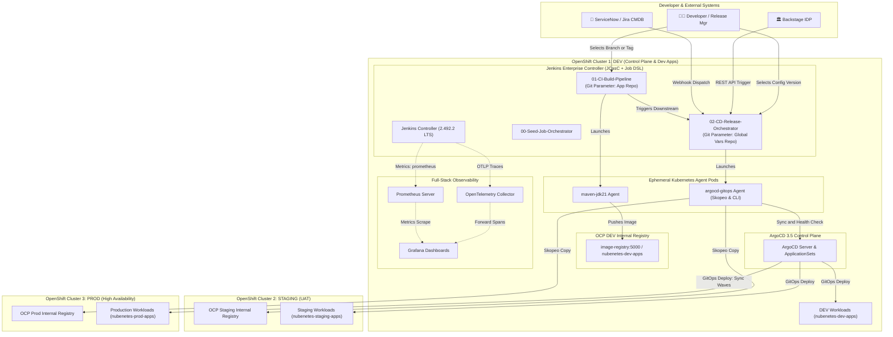
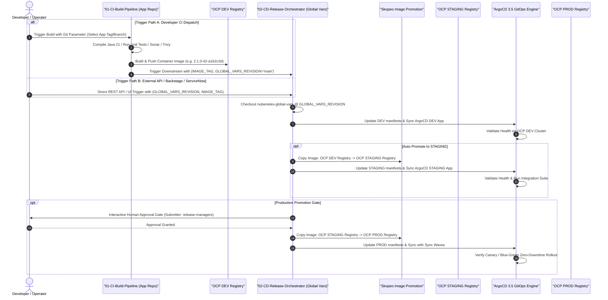
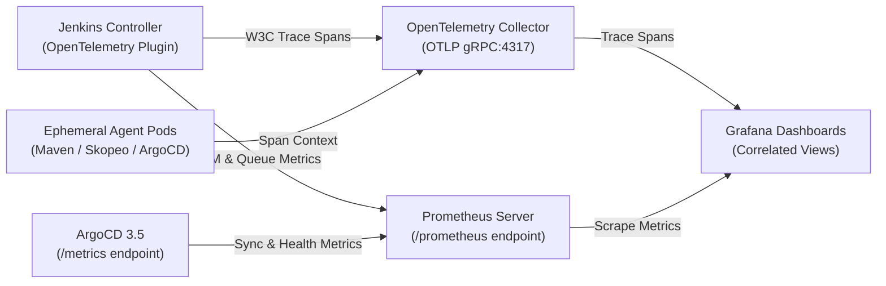

# Jenkins Git Parameter & Multi-Cluster GitOps IaC Platform on OpenShift 4.20+

> [!WARNING]
> **AI Generation & Template Disclaimer**
> This repository has been generated by **Gemini 3.7 Flash** and has not been tested nor validated in a real production environment. Its purpose is strictly for the generation of reference architectures, templates, design patterns, and Infrastructure as Code (IaC) blueprints.

<div align="center">

[](https://docs.redhat.com/en/documentation/openshift_container_platform/4.17/)
[](https://kubernetes.io/)
[](https://www.jenkins.io/)
[](https://argo-cd.readthedocs.io/en/stable/)
[](https://helm.sh/)

[](https://www.jenkins.io/projects/jcasc/)
[](https://jenkinsci.github.io/job-dsl-plugin/)
[](https://plugins.jenkins.io/git-parameter/)
[](https://opentelemetry.io/)
[](https://prometheus.io/)
[](https://grafana.com/)
[](https://openjdk.org/projects/jdk/21/)
[](https://spring.io/projects/spring-boot)
[](https://angular.dev/)
[](https://github.com/containers/skopeo)
[](https://trivy.dev/)
[](https://docs.redhat.com/en/documentation/openshift_container_platform/4.17/html/authentication_and_authorization/managing-pod-security-policies)
[](LICENSE)
[](https://github.com/nubenetes/jenkins-git-parameter/pulls)
[](https://github.com/nubenetes/jenkins-git-parameter)

</div>

---

## Executive Summary & Architecture Overview

This repository provides an enterprise-grade, end-to-end **Infrastructure as Code (IaC)** blueprint and GitOps orchestration engine hosted on **Red Hat OpenShift Container Platform (OCP) 4.20+**. 

The solution addresses a core enterprise challenge: **how to build, govern, promote, and release multi-repository cloud-native microservices across 3 distinct OpenShift clusters (DEV, STAGING, PROD) while leveraging dynamic Git Parameter selection, Declarative Pipelines as Code, ArgoCD 3.5 GitOps synchronization, and unified OpenTelemetry observability.**



---

## In-Depth Architectural Analysis & Design Decisions

### 1. Multi-Repository Git Parameter Investigation: The Decoupled 2-Pipeline Pattern

#### The Core Problem
In enterprise architectures, microservices separate application code (`app-repo`) from centralized environmental configuration, secrets, cluster definitions, and helm values (`nubenetes-global-vars`). 

When applying the Jenkins `git-parameter` plugin to a pipeline that needs to check out **both** repositories, a fundamental limitation arises in standard Jenkins Declarative Pipelines:
1. **Parameter Evaluation Lifecycle**: Jenkins evaluates job parameters (including remote branch/tag queries via Git Parameter) **before** workspace allocation and before the `Jenkinsfile` executes.
2. **SCM Binding**: The `git-parameter` plugin relies on the SCM defined in the Jenkins Job XML. In a single Declarative Pipeline job that dynamically checks out a secondary Git repository inside a stage (`steps { checkout(...) }`), Jenkins master cannot inspect the secondary repository's remote Git references prior to build execution.

```
┌─────────────────────────────────────────────────────────────────────────────┐
│ ❌ Monolithic Single Pipeline Antipattern:                                   │
│    Git Parameter cannot inspect Secondary Repo before workspace execution    │
└─────────────────────────────────────────────────────────────────────────────┘
```

#### The Recommended Solution: Decoupled Two-Pipeline Orchestration
We implement two linked, specialized pipelines provisioned dynamically via Job DSL:



#### Benefits of Decoupled Architecture:
- **Clean SCM Separation**: Pipeline 1 binds its Git Parameter to the Application repo; Pipeline 2 binds its Git Parameter to the Global Vars repo.
- **External Integration Friendly**: Pipeline 2 exposes a clean REST API interface (`/job/02-CD-Release-Orchestrators/job/multi-cluster-release-orchestrator/buildWithParameters`) allowing Backstage IDP, ServiceNow ITSM change requests, or Jira workflows to trigger deployments with explicit configuration tags.
- **Independent Lifecycles**: A release manager can redeploy or promote an existing, pre-built immutable image against an updated global configuration branch without recompiling or rebuilding the application.

---

### 2. Job DSL + Declarative Pipelines vs. Monolithic Shared Libraries

| Dimension | Monolithic Shared Library Antipattern (`@Library('...') _`) | Modern Architecture: Job DSL + Declarative Templates + Granular Steps |
| :--- | :--- | :--- |
| **Pipeline Visibility** | Opaque black box; stages hidden inside Groovy scripts | Full Stage View and Blue Ocean visualization natively rendered |
| **Jenkins Replay** | ❌ **Broken**: Replay cannot modify Shared Library code | ✅ **100% Functional**: Developers can replay and edit pipeline stages in UI |
| **Job Provisioning** | Manual UI creation or complex custom scripts | Automated Seed Job (`seed-job.groovy`) reconciles all jobs from Git |
| **Syntax Validation** | Runtime-only Groovy failures | Declarative linter validates syntax at definition time |
| **Step Reusability** | Tight coupling; copy-pasting scripted logic | Granular custom steps (`argoAppSync`, `skopeoPromote`, `gitopsCommit`) |

**Decision**: We use **Job DSL** to generate **Declarative Pipeline jobs** pointing to standard declarative `Jenkinsfile` definitions, complemented by a **lightweight Jenkins Shared Library** containing modular, reusable steps.

---

### 3. OpenShift 4.20+ Security & Ephemeral Kubernetes Agents

1. **Security Context Constraints (SCC)**:
   - Jenkins Controller runs under `restricted-v2` / `nonroot` SCC without requiring root privileges.
   - UID and GID are pinned to `1000:1000`.
   - Dynamic ephemeral agents run inside dedicated non-privileged containers.
2. **Zero Permanent Executors on Controller**:
   - `numExecutors: 0` configured in JCasC. The master controller is exclusively a coordinator.
   - All builds run inside short-lived agent pods (`maven-jdk21`, `node-angular`, `skopeo-trivy`, `argocd-gitops`) created on-demand and terminated immediately upon stage completion.
3. **OpenShift Route with Edge TLS**:
   - Secure external ingress via OpenShift HAProxy Route with automatic HTTP-to-HTTPS redirect and TLS termination.

---

### 4. ArgoCD 3.5 Integration & Multi-Cluster Promotion

1. **Multi-Cluster Topology**:
   - **Cluster 1 (`ocp-dev`)**: Hosts Jenkins Master, ArgoCD 3.5 Controller, OpenTelemetry Collector, and DEV workloads.
   - **Cluster 2 (`ocp-staging`)**: External target cluster registered in ArgoCD via Kubernetes cluster secrets (`cluster-ocp-staging`).
   - **Cluster 3 (`ocp-prod`)**: Production cluster managed remotely by ArgoCD (`cluster-ocp-prod`).
2. **ApplicationSets & Sync Waves**:
   - `ApplicationSet` generators dynamically provision application targets per cluster.
   - ArgoCD sync waves enforce strict ordering: Database migrations (Wave 1) $\rightarrow$ Backend Microservices (Wave 2) $\rightarrow$ Frontend SPA & Routes (Wave 3).
3. **Skopeo Cross-Cluster Image Copy**:
   - Images are copied directly between cluster internal registries (`image-registry.openshift-image-registry.svc:5000`) without spinning up a Docker daemon or intermediate worker storage.

---

### 5. Full-Stack Observability: OpenTelemetry, Prometheus & Grafana



- **W3C Distributed Tracing**: Every pipeline execution generates a root trace. Stages and steps become child spans.
- **Metric Correlation**: Prometheus scrapes build duration, queue wait times, and agent scaling metrics.
- **Grafana Preloaded Dashboards**:
  - `jenkins-performance-otel.json`: Visualizes stage durations, queue latency, success rates, and ephemeral pod concurrency.
  - `argocd-gitops-sync.json`: Visualizes application sync phases, cluster health, and drift detection.

---

## Repository Structure

```
jenkins-git-parameter/
├── README.md                                # Architectural analysis, documentation, and references
├── Makefile                                 # Platform lifecycle commands (deploy, destroy, lint, status)
├── deploy.sh                                # 1-Click deployment automation script
├── destroy.sh                               # 1-Click decommissioning script
├── reinstall.sh                             # Clean reinstall orchestration
├── config/
│   ├── clusters.yaml                        # Multi-cluster topology definition (DEV, STAGE, PROD)
│   └── environments.env                     # Pinned version matrix and environment parameters
├── helm/
│   ├── jenkins/
│   │   ├── Chart.yaml                       # Jenkins Helm chart wrapper
│   │   ├── values.yaml                      # Pinned base values & plugin list
│   │   ├── values-openshift.yaml            # OpenShift 4.20+ overrides (SCC, Routes, JCasC mounts)
│   │   └── plugins.txt                      # Pinned plugin manifest with exact version numbers
│   ├── argocd/
│   │   └── values-argocd-3.5.yaml           # ArgoCD 3.5 Helm values & ApplicationSet controller
│   └── observability/
│       ├── otel-collector-values.yaml       # OpenTelemetry Collector configuration
│       ├── grafana-values.yaml              # Grafana datasources & dashboard providers
│       └── prometheus-values.yaml           # Prometheus scrape configurations
├── jcasc/
│   ├── jenkins-jcasc.yaml                   # Jenkins Configuration as Code (Security, OTel, Seed Job)
│   └── pod-templates.yaml                   # Ephemeral Kubernetes Agent pod templates
├── jobdsl/
│   ├── seed-job.groovy                      # Master Seed Job provisioning all pipelines
│   ├── pipelines-ci.groovy                  # Job DSL for Application CI pipelines (Git Parameter on App)
│   └── pipelines-cd.groovy                  # Job DSL for CD Release Orchestrators (Git Parameter on Vars)
├── jenkinsfiles/
│   ├── ci/
│   │   ├── Jenkinsfile.app-java-maven       # Declarative CI pipeline for Java 21 Spring Boot
│   │   └── Jenkinsfile.app-angular          # Declarative CI pipeline for Angular 18+
│   └── cd/
│       ├── Jenkinsfile.release-orchestrator # Declarative Multi-Cluster Release & Promotion pipeline
│       └── Jenkinsfile.hotfix-deploy        # Fast-track emergency hotfix pipeline
├── shared-library/
│   ├── vars/
│   │   ├── argoAppSync.groovy               # Step: Trigger & wait for ArgoCD 3.5 sync
│   │   ├── skopeoPromote.groovy             # Step: Promote container image between cluster registries
│   │   ├── gitopsCommit.groovy              # Step: Update GitOps environment repository
│   │   └── otelLogEvent.groovy              # Step: Annotate OpenTelemetry spans
│   └── src/com/nubenetes/gitops/
│       └── ClusterEnvironment.groovy       # Strongly typed Groovy cluster model
├── argocd-apps/
│   ├── root-app-of-apps.yaml                # ArgoCD Root App-of-Apps pattern
│   ├── applicationset-clusters.yaml         # Multi-Cluster ApplicationSet generator
│   └── apps/
│       ├── dev/jhipster-microservice.yaml
│       ├── staging/jhipster-microservice.yaml
│       └── prod/jhipster-microservice.yaml
├── sample-apps/
│   ├── jhipster-microservice/               # PoC Java 21 / Spring Boot 3 microservice
│   │   ├── Dockerfile                       # Multi-stage container build
│   │   ├── pom.xml
│   │   ├── src/...
│   │   └── k8s/                             # Kustomize base & overlays (dev, staging, prod)
│   └── nubenetes-global-vars/               # Centralized Global Configuration repository
│       ├── environments/{dev,staging,prod}.yaml
│       └── clusters/{ocp-dev,ocp-staging,ocp-prod}.yaml
├── observability/
│   └── dashboards/
│       ├── jenkins-performance-otel.json    # Grafana Dashboard: Pipeline & OTel Spans
│       └── argocd-gitops-sync.json          # Grafana Dashboard: ArgoCD GitOps Sync & Health
└── scripts/
    ├── ocp-setup-scc.sh                     # Configure OpenShift SCC & RBAC
    ├── setup-argocd-clusters.sh             # Register STAGING and PROD clusters in ArgoCD
    └── generate-tokens.sh                   # Generate auth secrets and tokens
```

---

## Quick Start: 1-Click Automated Deployment

### Prerequisites
- OpenShift 4.20+ CLI (`oc` or `kubectl`) logged in with cluster administrator permissions (`cluster-admin`).
- Helm 3.14+.
- Bash shell.

### 1. Deploy the Complete Platform
To automatically provision all namespaces, security context constraints, JCasC ConfigMaps, OpenTelemetry Collector, Prometheus, Grafana, ArgoCD 3.5, and Jenkins Controller with the Seed Job:

```bash
git clone https://github.com/nubenetes/jenkins-git-parameter.git
cd jenkins-git-parameter
chmod +x deploy.sh
./deploy.sh
```
*Or using Make:*
```bash
make deploy
```

### 2. Verify Platform Endpoints
After deployment completes, the script outputs the operational routes:

| Service | URL / Route | Credentials |
| :--- | :--- | :--- |
| **Jenkins Master** | `https://jenkins-jenkins.apps.ocp-dev.nubenetes.internal` | `admin` / `admin123!` |
| **ArgoCD 3.5 UI** | `https://argocd-server.apps.ocp-dev.nubenetes.internal` | `admin` / *(retrieved via secret)* |
| **Grafana Dashboards**| `http://grafana.observability.svc.cluster.local:3000` | `admin` / `admin123!` |
| **OTel Collector** | `http://otel-collector.observability.svc.cluster.local:4317` | *OTLP gRPC endpoint* |

### 3. Triggering Pipelines

#### Scenario A: Build Application from Selected Branch
1. Navigate to Jenkins UI $\rightarrow$ `01-CI-Build-Pipelines` $\rightarrow$ `jhipster-microservice-ci-build`.
2. Click **Build with Parameters**.
3. Select the desired `APP_GIT_REVISION` branch/tag from the Git Parameter dropdown.
4. Keep `TRIGGER_CD_RELEASE` checked to automatically hand off the built image to the Release Orchestrator.

#### Scenario B: Trigger Multi-Cluster Release from Backstage or ServiceNow
To trigger a release directly via API using a specific configuration version from `nubenetes-global-vars`:

```bash
curl -X POST "https://jenkins-jenkins.apps.ocp-dev.nubenetes.internal/job/02-CD-Release-Orchestrators/job/multi-cluster-release-orchestrator/buildWithParameters" \
  --user "ci-service:service123!" \
  --data-urlencode "GLOBAL_VARS_REVISION=v2.1.0-release" \
  --data-urlencode "APP_NAME=jhipster-microservice" \
  --data-urlencode "IMAGE_TAG=2.1.0-42-a1b2c3d" \
  --data-urlencode "TARGET_ENVIRONMENT=full-promotion-chain" \
  --data-urlencode "AUTO_PROMOTE_TO_STAGING=true" \
  --data-urlencode "REQUIRE_PROD_APPROVAL=true" \
  --data-urlencode "TRIGGERED_BY=BACKSTAGE_IDP" \
  --data-urlencode "CHANGE_REQUEST_ID=CHG-2026-98124"
```

---

## Decommissioning & Reinstallation

### Clean Decommission
To cleanly delete all Helm releases, ConfigMaps, and namespaces:
```bash
./destroy.sh
# or
make destroy
```

### Full Reinstallation
To perform a complete wipe and redeployment:
```bash
./reinstall.sh
# or
make reinstall
```

---

## References & Evidence Links

The design patterns and technical configurations implemented in this repository are based on official documentation and industry standards:

1. **Jenkins Official Helm Chart & Documentation**:
   - [Jenkins Official Helm Chart Repository](https://github.com/jenkinsci/helm-charts)
   - [Jenkins Configuration as Code (JCasC) Reference](https://www.jenkins.io/projects/jcasc/)
   - [Jenkins Job DSL Plugin API & Multi-Branch Guide](https://jenkinsci.github.io/job-dsl-plugin/)
   - [Jenkins Git Parameter Plugin Documentation](https://plugins.jenkins.io/git-parameter/)
   - [Jenkins Declarative Pipeline Syntax Specification](https://www.jenkins.io/doc/book/pipeline/syntax/)
2. **Red Hat OpenShift 4.20+ Platform Documentation**:
   - [OpenShift Container Platform 4.17/4.20 Architecture & Hardening](https://docs.redhat.com/en/documentation/openshift_container_platform/)
   - [Managing Security Context Constraints (SCC) in OpenShift](https://docs.redhat.com/en/documentation/openshift_container_platform/4.17/html/authentication_and_authorization/managing-pod-security-policies)
   - [Configuring OpenShift Routes & Ingress TLS Termination](https://docs.redhat.com/en/documentation/openshift_container_platform/4.17/html/networking/configuring-routes)
3. **ArgoCD 3.5 & GitOps Standards**:
   - [ArgoCD Official Documentation](https://argo-cd.readthedocs.io/en/stable/)
   - [ArgoCD ApplicationSet Controller Multi-Cluster Generators](https://argo-cd.readthedocs.io/en/stable/operator-manual/applicationset/Generators-List/)
   - [ArgoCD Sync Waves and Phases Reference](https://argo-cd.readthedocs.io/en/stable/user-guide/sync-waves/)
4. **Container Image Promotion & Security**:
   - [Skopeo Container Image Copy Tool Documentation](https://github.com/containers/skopeo)
   - [Aqua Security Trivy Vulnerability Scanner](https://aquasecurity.github.io/trivy/)
5. **Observability & OpenTelemetry**:
   - [Jenkins OpenTelemetry Plugin Documentation](https://plugins.jenkins.io/opentelemetry/)
   - [OpenTelemetry Collector Architecture](https://opentelemetry.io/docs/collector/)
   - [Prometheus Scrape Configuration & Grafana Datasources](https://prometheus.io/docs/prometheus/latest/configuration/configuration/)
